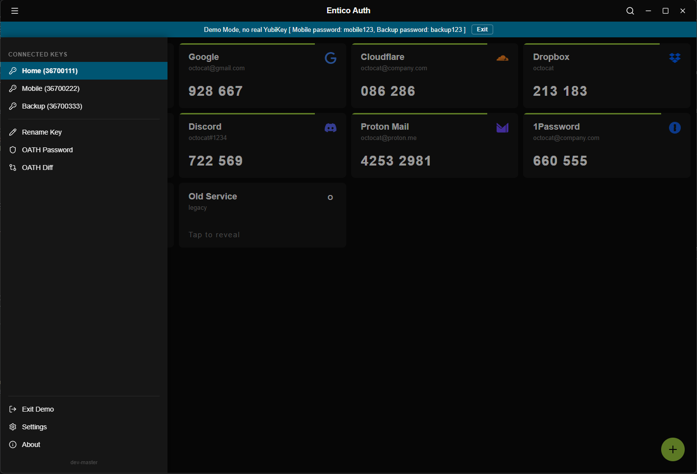
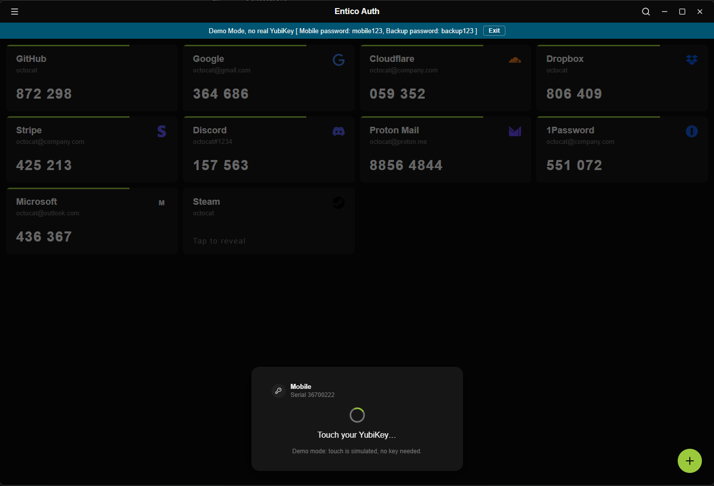
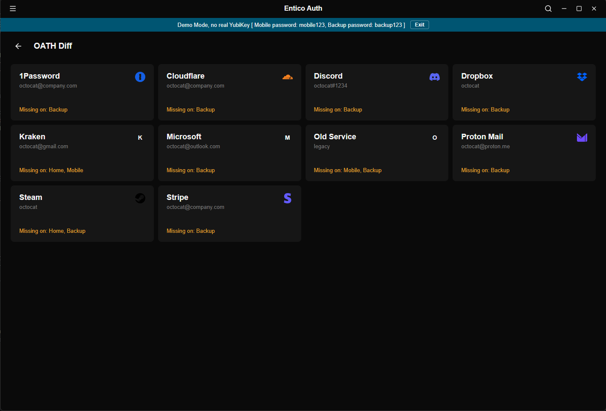

# Entico Auth

A focused Windows desktop app for viewing and managing TOTP accounts stored on a
[YubiKey](https://www.yubico.com/)'s OATH application - styled in the spirit of
[Ente Auth](https://ente.io/auth), built with [Tauri](https://tauri.app/) + Vue 3.

There is no local secret store. Every code is computed live on the hardware key by shelling out
to the official [`ykman`](https://developers.yubico.com/yubikey-manager/) CLI - Entico Auth is a
thin, good-looking window onto whatever is already on your key, nothing more.

## Features

The look and feel of [Ente Auth](https://ente.io/auth) - a clean, live account grid instead of
the official [Yubico Authenticator](https://www.yubico.com/products/yubico-authenticator/)'s
utilitarian list - plus a few YubiKey-specific things Yubico Authenticator doesn't do:

- **Add an account to every connected key at once**, instead of repeating manual entry per key.
- **A diff view across connected keys** - see at a glance which accounts are missing or out of
  sync between two keys, and fix it from the same screen.
- **Optional Windows Hello confirmation** on every write (add, rename, delete, OATH password changes), so
  a second person at an unlocked, unattended machine can't slip a change through.
- **Try Demo mode** - explore the full UI with simulated accounts, no YubiKey required.

Beyond that: QR-code account import, tap-to-reveal accounts, rename/delete, OATH password
support, multi-key switching, system tray with autostart, and search. No secrets are ever
stored by Entico Auth - only non-sensitive settings like window/tray behavior, or custom key names are persisted.

## Requirements

- Windows 10/11
- [YubiKey Manager](https://developers.yubico.com/yubikey-manager/Releases/) (`ykman.exe`)
  installed
- A YubiKey with the OATH application enabled
- Optional: Windows Hello enrolled, for additional write-protection when `ykman` remembers your password

## Installation

Download the latest installer (`.msi` or `.exe`) from the
[Releases](https://github.com/zolex/entico-auth/releases) page and run it.

## Demo

No YubiKey or `ykman` install handy? Pick "Try Demo" from the menu. It swaps in a fully simulated
key with a few sample accounts, computed with real TOTP math, so codes tick over just like the
real thing. Every feature works against it - add, rename, delete, touch-required reveal, multi-key
diff - nothing here ever touches actual hardware or `ykman.exe`. A banner stays on screen the whole
time so it's never mistaken for a real key. Exit any time from the same menu.

### Menu with multiple YukiKeys

### YoubiKey Touch protection

### Yubikey Diff

